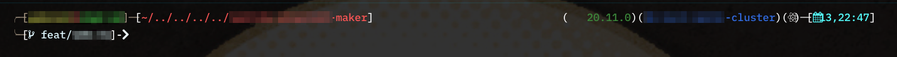
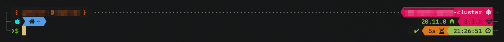

# Oh My Posh Theme - bit10k 

This theme is meant to be a cross between the existing OMP theme [atomicBit](https://ohmypo.sh/docs/themes#atomicbit) (*at least from an inspirational standpoint*) and the popular [powerlevel10k](https://github.com/romkatv/powerlevel10k) (*or at least, my customization of it, see screenshots below*). 

The theme is organized as follows: 

```shell
<Block 1>.......<Block 2>
<Block 3>       <Block 4>
<Block 5>       <Block 6>
```

## Block 1: User Info

This shows the `host @username` 

## Block 2: Cloud Info

This shows the following info in order from left to right: 

1. Kubernetes (*i.e. `kubectl`*) clusters or sessions 
2. AWS (*displays the currently active profile*)
3. Docker (*displays the currently active context, except `default`*) 

## Block 3: Working Info

 This shows the following info in order from left to right: 

1. OS Icon 
2. Current working directory / current folder name & Git status 
   1. If you're in your home directory, this will show house emoji followed by a ` ~` 
   2. For the Git status, the background color changes based on the state 
      1. When the repo is clean, the background color is green 
      2. When there are working changes, the background color is yellow 

## Block 4: Language Info 

This shows the following info in order from left to right: 

1. Secondary Languages: These may be hidden first if `<Block 3>` gets too long. (*NOTE: this is untested*) 
   1. **Azure Functions** (*the version of the currently active CLI*) 
   2. **.NET** (*the version of the currently active SDK*) 
   3. **Golang** (*the version of what's currently active*) 
   4. **Java** (*the version of what's currently active*) 
   5. **Python** (*the version of what's currently active*) 
   6. **Quasar** (*the version of the currently active CLI*) 
2. Primary Languages: 
   1. Current project / package version  

> NOTE: The primary languages use the `powerline` styling, whereas the secondary language are using `plain` surrounded by parentheses. 
>
> i.e. Primary languages look more like "powerlevel10k" and secondary looks more like "atomicBit" 

## Block 5: User Entry 

m 

## Block 6: Status Info 

m 

## Screenshots 

Original / current version of AtomicBit:



My customization of `powerlevel10k`:



more 

